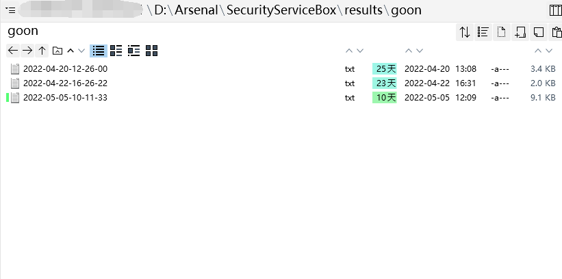

# SecurityServiceBox

<aside> 💡 一个Windows平台下既可以满足安服仔日常渗透工作也可以批量刷洞的工具盒子。
大佬轻喷

## 0x01 前言

作为一个安服仔，日常渗透中，不同阶段所使用的工具是不同的，除开自动化一条龙的脚本之外，很多时候是需要反复的进入不同的文件夹运行不同的命令，每次使用工具的时候命令可能也是一样的，那么是否有种方式将常用的工具，常用的命令集成在一起，渗透的时候仅需给定目标，就可以调用工具自动执行命令。之前流行过的`GUI_Tools`是一个，有了图形化页面，点击即可运行，但是一个是在Windows环境下界面实在不敢恭维，一个是无法更好的交互（或者也许我没找到交互的方式）。后来无意间发现了阿浪师傅写的一个自用的命令行调用工具，也就是Wanli的初始版本。最开始也在公众号文章说过，最初的设定是“把常用的工具给做了一个调用整合到一个程序内，功能拓展比较方便，目前是根据自己的一些习惯写的，比如目录扫描、子域名爆破+验证、漏洞扫描”。就相当于一个快捷启动工具，与GUI_Tools不同的是，Wanli可以更好的交互，执行自定义的命令。当然，并无比较的意思，两个师傅的工具都有在用（手动狗头 :）。

Wanli的项目地址：https://github.com/ExpLangcn/WanLi‣

与最初的版本不同，最新的Wanli定位发生了变化，由自用的调度工具变为了偏向红队的收集漏扫一体化工具，效果同样顶呱呱。本篇文章依据Wanli的初始版本。

## 0x02 运行截图

运行主界面：


基于Win环境下运行`cmd /k` 即可新开cmd窗口，除`collect_subdomain`之外，其余工具均可无需等待当前命令执行结束直接执行下一条命令。且支持TAB键关键字自动补全。

动态截图：


命令执行结束后，在results文件夹下可查看输出的报告(Finger扫描的结果在`tools/collect/finger/output`文件夹内)



## 0x03 集合

目前为止，工具集合了常见的域名收集、目录扫描、ip扫描、指纹扫描、PoC验证等常用工具，具体如下：

域名收集：

- subfinder:[subfinder(github.com)](https://github.com/projectdiscovery/subfinder)
- ksubdomain:[knownsec/ksubdomain: 无状态子域名爆破工具 (github.com)](https://github.com/knownsec/ksubdomain)

指纹扫描：

- Finger:[EASY233/Finger: 一款红队在大量的资产中存活探测与重点攻击系统指纹探测工具 (github.com)](https://github.com/EASY233/Finger)

ip扫描：

- smap:[s0md3v/Smap: a drop-in replacement for Nmap powered by shodan.io (github.com)](https://github.com/s0md3v/Smap)
- fscan:[shadow1ng/fscan: 一款内网综合扫描工具，方便一键自动化、全方位漏扫扫描。 (github.com)](https://github.com/shadow1ng/fscan)
- goon: [(github.com)](https://github.com/i11us0ry/goon)

目录扫描：

- dirsearch:[maurosoria/dirsearch: Web path scanner (github.com)](https://github.com/maurosoria/dirsearch)
- ffuf:[ffuf/ffuf: Fast web fuzzer written in Go (github.com)](https://github.com/ffuf/ffuf)

PoC扫描：

- afrog:[zan8in/afrog: 一个挖洞工具 - A tool for finding vulnerabilities (github.com)](https://github.com/zan8in/afrog)
- autoxray:内置，xray basic爬虫模式自动批量扫描
- nuclei:[projectdiscovery/nuclei: Fast and customizable vulnerability scanner based on simple YAML based DSL. (github.com)](https://github.com/projectdiscovery/nuclei)
- pocsearch:内置，搜索CVE编号漏洞的poc/exp在Github的地址
- rad:[chaitin/rad (github.com)](https://github.com/chaitin/rad)
- vulmap:[zhzyker/vulmap: Vulmap 是一款 web 漏洞扫描和验证工具, 可对 webapps 进行漏洞扫描, 并且具备漏洞验证功能 (github.com)](https://github.com/zhzyker/vulmap)
- xrad:内置，xray和rad联动扫描

中间件检测利用：

- Shiro: https://github.com/j1anFen/shiro_attack
- Struts2
- ThinkPHP
- Weblogic:https://github.com/21superman/weblogic_exploit
- 通达OA

socks5代理：

- RotateProxy：[akkuman/rotateproxy: 利用fofa搜索socks5开放代理进行代理池轮切的工具 (github.com)](https://github.com/akkuman/rotateproxy)

其他工具：

- AppInfoScanner：https://github.com/kelvinBen/AppInfoScanner
- frida-skeleton：https://github.com/Margular/frida-skeleton
- Packer-Fuzzer：https://github.com/rtcatc/Packer-Fuzzer

## 0x04 定位

如前言中所说，此框架仅仅是把渗透的常用工具集成进来，作为一个快速启动，并将输出统一到同一项目文件夹下，方便安全测试人员快速高效展开渗透测试。所以定位就是渗透盒子，辅助工具。但通过将subfinder、ksubdomain、finger整合，通过一条命令也可做到资产收集验证指纹扫描，结合PoC扫描验证也可进行批量刷洞。

## 0x05 安装

#### 拉取项目

依赖于Py3.6以上版本

```markdown
git clone https://github.com/givemefivw/SecurityServiceBox.git

cd SecurityServiceBox

pip install -r requirements.txt

python main.py
```

#### 下载工具

考虑到安全性，项目里面未存放tools，需自行将工具下载至本地，若是信得过，可直接到releases页面[Releases · givemefivw/SecurityServiceBox (github.com)](https://github.com/givemefivw/SecurityServiceBox/releases)下载打包好的tools压缩包，放入项目根目录下即可

## 0x06 增删改查

得益于阿浪师傅的框架，仅需四步即可进行工具的增删改查：

### Step 1 下载所需工具

将工具下载至项目的`tools`文件夹下，可根据工具的功能进行分类，例如以下`pocScan`文件夹下存放的是nuclei、vulmap等poc扫描工具：


### Step 2 添加config参数

修改`config/config.py`中，将新增的工具的路径添加进去，除python环境的绝对路径之外，其余工具推荐使用相对路径，由于是Win环境，在添加exe工具时，需要使用`\\\\`符号防止转义：


### Step 3 注册参数

例如想添加`pocscan_nuclei`扫描，那么我们只需在`main.py`里面添加如下代码：

```markdown
pocscan_nuclei_parser = Cmd2ArgumentParser()
    pocscan_nuclei_parser.add_argument("-u", nargs='?', help="扫描单个目标")
    pocscan_nuclei_parser.add_argument("-f", nargs='?', help="指定文本进行批量漏洞扫描")
    pocscan_nuclei_parser.add_argument("-p", nargs='?', help="设置socks代理进行批量漏洞扫描")

    @cmd2.with_argparser(pocscan_nuclei_parser)
```

此时即可完成参数的注册及帮助信息。

### Step 4 添加命令

`lib/cmd/wanli.py`文件中，定义预期执行的命令，例如添加nuclei批量扫描，通过system函数，调用config文件中定义的路径中的工具，执行拼接好的完整命令，增加或修改如下代码：

```markdown
@staticmethod
    def nuclei_file(file):
        system(config.config.pocscan_nuclei + " -ut && " + config.config.pocscan_nuclei + " -update")
        system(r"start cmd /k " + config.config.pocscan_nuclei + r" -l " + file +
               " -s medium,high,critical -rate-limit 100 -bulk-size 25 "
               "-concurrency 25 -stats -si 300 -retries 3")
```

此时就完成了一个工具执行的添加，在运行`main`函数之后，只需执行`pocscan_nuclei -f url.txt`命令，控制台就会自动的执行完整的较长的命令，不需要每次都进入nuclei的文件夹然后手动输入较长的命令。
